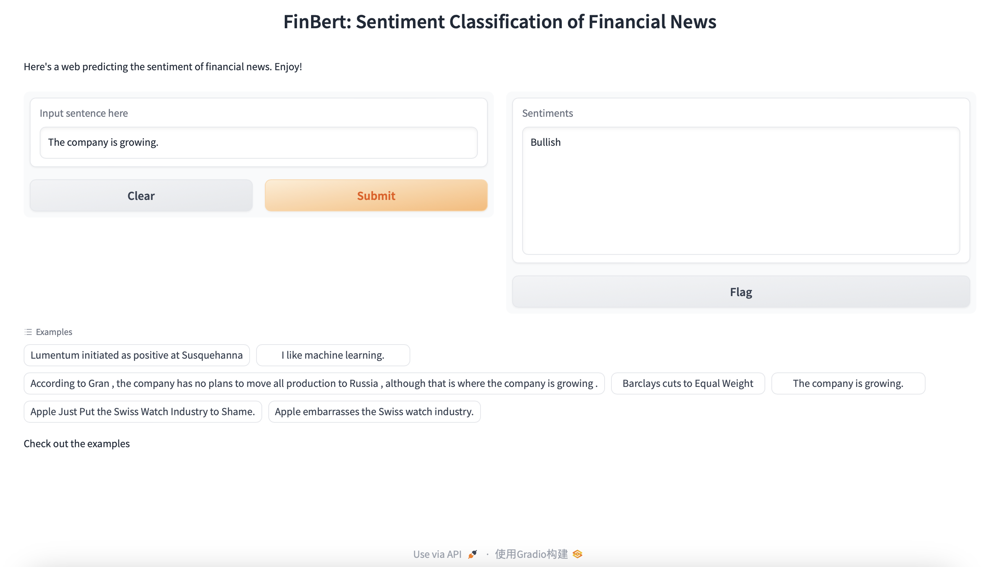

# NLP课程大作业报告 - 2020201416

## 任务描述
金融新闻情感分析（***Financial News Sentiment Analysis***），即对于给定的新闻文本，判断此信息对股票市场情绪的影响：看涨、看跌、中立（***Bullish, Bearish, Neutral***）

## 数据准备
### [英文数据](./src/dataset/us/)
1. 数据获取：[Twitter Financial News Sentiment(TFNS)](https://huggingface.co/datasets/zeroshot/twitter-financial-news-sentiment)
- 金融行业相关的推特文本数据集；
- 总共包含11,932条数据，其中训练集9,938条，测试集2,486条；
- 配有文本情感标签；
```
sentiments = {
    "LABEL_0": "Bearish", 
    "LABEL_1": "Bullish", 
    "LABEL_2": "Neutral"
}
```

2. 数据清洗（[data.py](./src/scripts/data.py)）
- *strip_all_entities( text )*：去除推特中的链接、引用、特殊标点符号等；
- *clean_hashtags( text )*：去除推特文本中的主题标签( hashtag )；
- *remove_mult_spaces( text )*：去除多余空格；

3. 数据增强（[data_aug.py](./src/scripts/data_aug.py)）  
利用翻译大模型进行文本回译（*Back Translation*），在增加数据量的同时，还可以增强模型的鲁棒性。
```
import nlpaug.augmenter.word as naw

text = 'The quick brown fox jumped over the lazy dog'
back_translation_aug = naw.BackTranslationAug(
    from_model_name='facebook/wmt19-en-de', 
    to_model_name='facebook/wmt19-de-en'
)
back_translation_aug.augment(text)
# Output[0]: 'The speedy brown fox jumped over the lazy dog'
```

### [中文数据](./src/dataset/cn/)
1. 数据获取（[get_cn_data.py](./src/scripts/cn_data_preparation/get_cn_data.py)）  
- 爬虫爬取[东方财富网-股吧](https://guba.eastmoney.com)的数据，选取沪深300成分股，爬取其最近一段时间的资讯文本和日期数据；
- 总共获取35,648条数据，其中训练集28,518条，测试集7,130条；

2. 数据标注（[label_cn_data.py](./src/scripts/cn_data_preparation/label_cn_data.py)）  
与英文数据不同的是，我们爬取的资讯信息并没有天然的情感标签，因此，我们利用市场，对数据进行标注。  
    1. 设定事件窗口期，即理论上事件发生对公司股价影响的持续期。在项目中设置为5天，即我们认为，事件发生后，在5天内公司的股价将收到持续影响；  
    2. 计算事件窗口期内，公司股价的变化（change）；  
    3. 根据股价变化，判断该资讯对股票市场的影响：
    * change < -200BP：Bearish
    * change > 200BP：Bullish
    * 其他：Neutral  
    4. 优点：
    * 使用市场真实数据进行标注，比人工判断情感属性更高效；
    * 人工标注可能会具有偏差，市场数据更能反映实际情况；
    * 实际上，我们判断金融资讯的文本情感的目的就是为了预测市场变化，直接用市场变化进行标注可以让模型学习到其中的规律；
    5. 缺点：
    * 股价变化收到的影响因素复杂多样，单一的资讯文本数据难以完全包含这些因素，因此会导致模型的预测效果较差；

3. 数据清洗（[clean_cn_data.py](./src/scripts/cn_data_preparation/clean_cn_data.py)）  
- 将资讯中原有的公司名称改为“*公司*”；
- 将资讯中原有的“*xx年xx月xx日*”改为“*某日*”；
- 删除文本中的注释及特殊标点符号等；

## 模型选择（[model.py](./src/scripts/model.py)）
考虑到项目任务仅需要理解文本，而不需要生成新文本，因此使用只包含encoder解码器的BERT模型。并在BertModel基础上，增加全连接层以完成下游的分类任务。
```
class MyModel(nn.Module):
    def __init__(self, args):
        super(MyModel, self).__init__()
        self.args = args
        self.device = "cuda:0" if torch.cuda.is_available() else "cpu"
        self.bert = BertModel.from_pretrained(self.args['bert_model'])
        # 让 bert 模型进行微调（参数在训练过程中变化）
        for param in self.bert.parameters():
            param.requires_grad = True
        # 全连接层
        self.linear = nn.Linear(self.args['num_filters'], len(self.args['sentiments']))

    def forward(self, x):
        input_ids, attention_mask = x[0].to(self.device), x[1].to(self.device)
        hidden_out = self.bert(input_ids, attention_mask=attention_mask, output_hidden_states=False)
        pred = self.linear(hidden_out.pooler_output)
        return pred
```
* 对于英文数据，BERT基础模型选择*bert-base-uncased*
* 对于中文数据，BERT基础模型选择*bert-base-chinese*

## 模型训练（[Finetune-BERT.ipynb](./src/scripts/Finetune-BERT.ipynb)）
### Environment
Google Colab with GPU Tesla T4(15G)
### Installation
```
pip install nlpaug sacremoses
git clone https://github.com/AI4Finance-Foundation/FinNLP
```

## 结果展示
Try on demo by running [demo.py](./src/scripts/demo.py):


### 英文数据
模型名称|TFNS Validation
:---:|:--:
Model-V1|88.02%
Model-V2|87.71%
FinBERT|73.28%
FiniGPT|90.30%

### 中文数据
模型名称|Eastmoney Validation
:---:|:--:
Model-CN|49.02%

### 模型说明
* Model-V1：使用原推特数据微调的BERT模型
* Model-V2：使用原推特数据以及通过回译进行数据增强得到的新数据微调的BERT模型
* Model-CN：使用东方财富网-股吧爬取的中文数据微调的BERT-Chinese模型
* [FinBERT](https://github.com/yya518/FinBERT)：a BERT model pre-trained on financial communication text. The purpose is to enhance finaincal NLP research and practice. It is trained on the following three finanical communication corpus. The total corpora size is 4.9B tokens.
* [FinGPT v3.3](https://github.com/AI4Finance-Foundation/FinGPT)：ChatGLM2 finetuned with LoRA method on the News and Tweets sentiment analysis dataset which achieve best scores on most of the financial sentiment analysis datasets.  
FinBERT和FinGPT用于结果对比。

### 结果分析
1. 对于英文数据
* 在使用相同的模型下，Model-V1相比与FinBERT在测试集上表现更好，是因为Model-V1使用专门的推特数据集进行训练；
* FinGPT使用ChatGLM作为基础模型，参数量为6b，因此效果优于Model-V1；
* Model-V2与Model-V1相比，尽管在测试集的预测准确率上有所下降，但是具有更强的鲁棒性。对于相同含义的不同句子，Model-V2更有可能识别成功：
```
# Model-V1
Input: Apple Just Put the Swiss Watch Industry to Shame.
Output: Bullish
Input: Apple embarrasses the Swiss watch industry.
Output: Neutral

# Model-V2
Input: Apple Just Put the Swiss Watch Industry to Shame.
Output: Bullish
Input: Apple embarrasses the Swiss watch industry.
Output: Bullish
```

2. 对于中文数据
* 由于中文数据使用真实市场数据进行标注，标签与文本情感的匹配性较弱，甚至可能出现文本几乎一致，但是股价变化方向相反的情况。因此对于模型来说，想要预测准确也就更难；
* 中文数据与英文数据在测试集准确率上的巨大差异也反映出：尽管当前通过LLM可以较准确地判断出文本情感，但想要依此掌握市场动向还是远远不够。
